# Frontend to Database Connection Flowchart

```mermaid
graph TD
    %% Frontend Components
    subgraph "Frontend (React)"
        FE_Views["Views (React Components)"]
        FE_Auth["Authentication (AuthContext)"]
        FE_API["API Service Layer"]
        FE_State["State Management"]
    end

    %% Backend API
    subgraph "Backend API (Django)"
        BE_Views["Views/Controllers"]
        BE_URLs["URL Routing"]
        BE_Serializers["Serializers"]
        BE_Auth["Authentication"]
    end

    %% Database Models
    subgraph "Database Models"
        %% User related models
        DB_Customer["Customer (User)"]
        DB_UserAddress["UserAddress"]
        DB_UserPayment["UserPayment"]
        DB_Notification["Notification"]
        DB_Wishlist["Wishlist"]
        
        %% Product related models
        DB_Product["Product"]
        DB_ProductCategory["ProductCategory"]
        DB_Brand["Brand"]
        DB_Color["Color"]
        DB_ProductImage["ProductImage"]
        DB_AttributeType["AttributeType"]
        DB_AttributeOption["AttributeOption"]
        DB_ProductAttribute["ProductAttribute"]
        DB_ProductInventory["ProductInventory"]
        DB_Discount["Discount"]
        DB_RatingReview["RatingReview"]
        DB_ProductPerformance["ProductPerformance"]
        
        %% Marketing related models
        DB_Bundle["Bundle"]
        DB_BundleItem["BundleItem"]
        DB_BundleRating["BundleRating"]
        DB_ProductBundleDiscount["ProductBundleDiscount"]
        
        %% Order related models
        DB_Cart["Cart"]
        DB_CartItem["CartItem"]
        DB_OrderDetails["OrderDetails"]
        DB_OrderItem["OrderItem"]
        DB_Payment["Payment"]
        DB_Shipping["Shipping"]
        DB_OrderReport["OrderReport"]
    end

    %% Frontend to Backend connections
    FE_Views --> FE_API
    FE_Auth --> FE_API
    FE_API --> BE_URLs
    FE_State --> FE_Views

    %% Backend connections
    BE_URLs --> BE_Views
    BE_Views --> BE_Serializers
    BE_Auth --> BE_Views
    BE_Serializers --> BE_Views

    %% Backend to Database connections
    BE_Serializers --> DB_Customer
    BE_Serializers --> DB_Product
    BE_Serializers --> DB_Bundle
    BE_Serializers --> DB_Cart
    BE_Serializers --> DB_OrderDetails

    %% Customer relationships
    DB_Customer --> DB_UserAddress
    DB_Customer --> DB_UserPayment
    DB_Customer --> DB_Notification
    DB_Customer --> DB_Wishlist
    DB_Customer --> DB_Cart
    DB_Customer --> DB_OrderDetails
    DB_Customer --> DB_RatingReview
    DB_Customer --> DB_BundleRating

    %% Product relationships
    DB_Product --> DB_ProductCategory
    DB_Product --> DB_Brand
    DB_Product --> DB_Color
    DB_Product --> DB_ProductImage
    DB_Product --> DB_ProductAttribute
    DB_Product --> DB_ProductInventory
    DB_Product --> DB_RatingReview
    DB_Product --> DB_ProductPerformance
    DB_Product --> DB_BundleItem
    DB_Product --> DB_CartItem
    DB_Product --> DB_OrderItem
    DB_Product --> DB_Wishlist
    DB_Product --> DB_ProductBundleDiscount

    %% Attribute relationships
    DB_AttributeType --> DB_AttributeOption
    DB_AttributeOption --> DB_ProductAttribute

    %% Bundle relationships
    DB_Bundle --> DB_BundleItem
    DB_Bundle --> DB_BundleRating
    DB_Bundle --> DB_ProductBundleDiscount

    %% Order relationships
    DB_Cart --> DB_CartItem
    DB_OrderDetails --> DB_OrderItem
    DB_OrderDetails --> DB_Payment
    DB_OrderDetails --> DB_Shipping
    DB_OrderDetails --> DB_OrderReport
    DB_OrderDetails --> DB_Discount

    %% Data flow annotations
    FE_API -->|HTTP Requests| BE_URLs
    BE_Serializers -->|JSON Data| FE_API
    BE_Views -->|CRUD Operations| BE_Serializers
```

## Frontend-Database Connection Details

### Frontend Components
1. **Views (React Components)**
   - User interface components that users interact with
   - Includes pages like Product listings, Cart, Checkout, User Profile, etc.

2. **Authentication (AuthContext)**
   - Manages user authentication state
   - Handles login, registration, and session management

3. **API Service Layer**
   - Makes HTTP requests to the backend API
   - Handles data fetching, error handling, and response parsing

4. **State Management**
   - Manages application state (cart items, user preferences, etc.)
   - Could be implemented using React Context, Redux, or similar

### Backend API (Django)
1. **URL Routing**
   - Maps URL endpoints to view functions
   - Defines the API structure and available endpoints

2. **Views/Controllers**
   - Processes incoming requests
   - Applies business logic
   - Returns appropriate responses

3. **Serializers**
   - Converts complex data types (Django models) to Python primitives
   - Transforms Python primitives to JSON for API responses
   - Validates incoming data

4. **Authentication**
   - Verifies user identity
   - Manages permissions and access control

### Database Models
The database schema is organized into several related sections:

#### User-related Models
- **Customer**: Extended user model with additional fields
- **UserAddress**: Stores shipping and billing addresses
- **UserPayment**: Saved payment methods
- **Notification**: User notifications
- **Wishlist**: Products saved by users

#### Product-related Models
- **Product**: Core product information
- **ProductCategory**: Hierarchical product categories
- **Brand**: Product brands
- **Color**: Product colors
- **ProductImage**: Product images
- **AttributeType/Option/ProductAttribute**: Product attributes system
- **ProductInventory**: Stock management
- **Discount**: Promotional discounts
- **RatingReview**: Product reviews and ratings
- **ProductPerformance**: Sales metrics

#### Marketing-related Models
- **Bundle**: Product bundles/packages
- **BundleItem**: Products in a bundle
- **BundleRating**: User ratings for bundles
- **ProductBundleDiscount**: Discounts for bundled products

#### Order-related Models
- **Cart/CartItem**: Shopping cart system
- **OrderDetails**: Order information
- **OrderItem**: Products in an order
- **Payment**: Payment information
- **Shipping**: Shipping details
- **OrderReport**: Order-related reports/issues

## Data Flow
1. User interacts with React frontend components
2. Frontend makes API requests to Django backend
3. Django processes requests, interacts with database models
4. Database returns data to Django
5. Django serializes data and returns JSON responses
6. Frontend updates UI based on responses

This architecture follows a typical client-server model with clear separation of concerns between the frontend user interface, backend business logic, and database persistence.